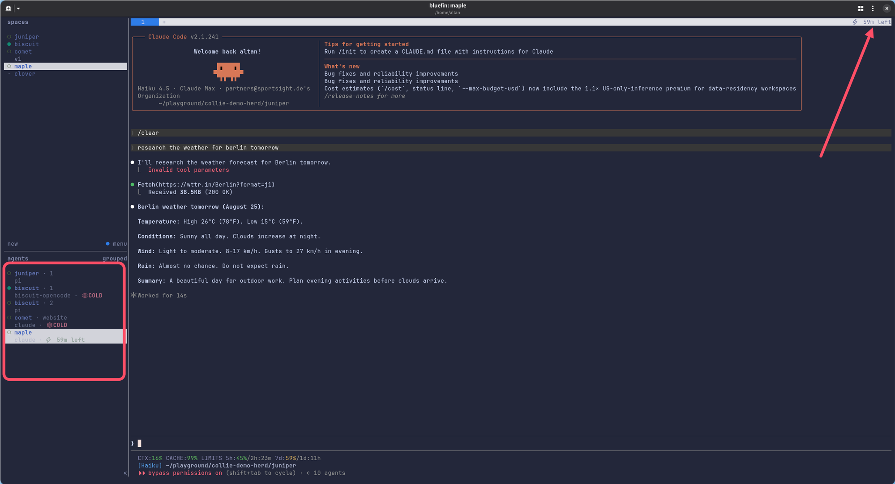
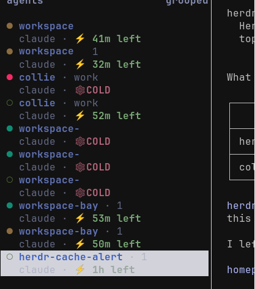

# Cache Alert

A [Herdr](https://herdr.dev) plugin that puts a prompt-cache countdown on every agent pane, and
marks the turns that missed the cache.

A cold turn re-reads your whole conversation at full input price, and makes you wait for it. The
badge tells you how long you have left, and tells you afterwards when you paid anyway.



## Install

Requires **Herdr 0.8+** and **Node 22.6+ or [Bun](https://bun.sh)**. No build step, no clone.

```bash
herdr plugin install AltanS/herdr-cache-alert
herdr plugin action invoke setup --plugin herdr.cache-alert
```

Herdr's agent hook must be installed for each harness you use. Without it the plugin cannot identify
the session, and it shows nothing. Run `herdr integration install claude` (also `codex`,
`opencode`), then **restart the agent in its pane**: the hook reports the session id at start.

Expected setup output:

```
✓ plugin        installed from GitHub, nothing to link
✓ cli           installed ~/.local/bin/herdr-cache-alert
✓ keybinding    prefix+alt+c toggles the agent-list badge
✓ sidebar       cache tokens styled in the agent sidebar
✓ tab bar       countdown added to the tab bar
✓ agent list    coloured badge ON, prefix+alt+c hides it
✓ watcher       started (pid 41233), ticks every 30s
✓ integrations  claude hook current
✓ badges        painted 6 of 6 agent panes
```

`✓` did it. `·` nothing to do. `!` needs you, with the remedy on the same line. Re-running setup is
safe, and it is how you repair an install. Check with `herdr-cache-alert status`.

Setup writes three marked blocks to `~/.config/herdr/config.toml`, between
`# cache-alert:begin <name>` and `# cache-alert:end <name>`: the keybinding, the sidebar rows, and
the `tab_bar_right` entry. Anything outside those markers is yours, and is never rewritten.
Uninstall removes exactly those blocks.

`setup --no-keys` skips the keybinding, so you can bind `herdr.cache-alert.toggle` yourself. Setup
also keeps a backup at `~/.config/herdr/config.toml.cache-alert-backup`, and uninstall leaves it
there.

## Update and remove

```bash
herdr plugin action invoke update --plugin herdr.cache-alert         # routine update
herdr plugin action invoke update-major --plugin herdr.cache-alert   # crossing a major
herdr plugin action invoke uninstall --plugin herdr.cache-alert
```

`herdr-cache-alert update` and `herdr-cache-alert uninstall` do the same from a shell. Uninstall
supports `--dry-run`.

## What you see

| badge | meaning |
| --- | --- |
| `⚡ 44m left` | warm, the cache survives another 44 minutes of idle time |
| `⚡ 4m left` | expiring, under 25% of the TTL (minimum 60s), drawn yellow in the sidebar |
| `❄ COLD` | the last turn missed the cache |
| *(nothing)* | unknown, and unknown paints nothing on purpose |

The number is idle time remaining. Every message you send resets it to the full TTL.

| surface | scope | works when |
| --- | --- | --- |
| **tab bar**, right side | focused pane | always, including a pane alone in its tab |
| **pane border** | that pane | the pane shares a tab with another |
| **agent sidebar**, coloured | every pane | the sidebar is open, `prefix+alt+c` toggles it |



## Nothing showing?

1. `herdr integration status` shows the harness hook as current, and the agent was restarted after
   you installed it.
2. `herdr-cache-alert doctor`, then look at `panes[].session`.
3. `herdr server reload-config` after any config edit. Herdr does not hot-reload `config.toml`.
4. `herdr-cache-alert watch status`.
5. `ui.hide_tab_bar_when_single_tab = true` hides the whole tab row, and the tab-bar badge with it.
6. The sidebar opens with `prefix+b`.

## Where the numbers come from

Cache lifetimes are vendor behaviour, not a standard, so no bare constant is allowed here. Every TTL
is a sourced claim carrying a documentation URL, a verbatim quote and the date it was checked.
`herdr-cache-alert claims` lists them, and `claims --stale` flags the old ones. A TTL measured from
the harness's own telemetry beats the documented one. When the plugin is unsure, the shorter TTL
wins.

## Harnesses

| harness | evidence it reads |
| --- | --- |
| **Claude Code** | the transcript: real cache token counts, and the TTL each turn wrote to |
| **Codex CLI** | the rollout log: `cached_input_tokens` from `token_count` records |
| **opencode** | the SQLite session store: `tokens.cache.read` |
| **OpenRouter** | none, forced only, countdown from the rule with no probe |

`herdr integration install opencode` is what reports opencode's session id. OpenRouter is never
auto-selected. Force it with `CACHE_ALERT_HARNESS=openrouter`.

## CLI and config

| command | does |
| --- | --- |
| `status [--pane ID]` | what every agent pane's cache is doing |
| `explain [--pane ID]` | where a pane's number comes from, claim by claim |
| `rules [--json]`, `claims [--stale DAYS]` | every cache rule with its sources, and the stale ones |
| `doctor` | resolved paths, per-pane detection, watcher state |
| `watch [--force\|stop\|status]` | the 30s repaint loop |
| `toggle [on\|off]` | the agent-list badge, bound to `prefix+alt+c` |
| `sync`, `clear` | paint every pane once, or remove every badge |
| `tabbar`, `tabbar-snippet`, `sidebar-snippet` | the tab-bar line, and the config entries to paste |
| `setup`, `update`, `uninstall` | install, advance, remove |

Config lives in `~/.config/herdr/plugins/config/herdr.cache-alert/config.json`. All keys optional.

| key | default | effect |
| --- | --- | --- |
| `warnSeconds` | `300` | reserved, not read yet. The warning threshold is 25% of the TTL |
| `quietWhileWarm` | `false` | show nothing until the cache is in trouble |
| `notifyOnCold` | `false` | raise a Herdr notification on an observed miss |
| `coldStickySeconds` | `120` | how long a cold mark stays after the cold turn |
| `pollMs` | `5000` | reserved, not read yet. The watcher ticks every 30s |
| `claimStaleDays` | `180` | how old a claim may get before `claims` complains |
| `forceHarness` | `""` | pin an adapter instead of detecting one |
| `forceTier` | `""` | pin `subscription` or `api` instead of detecting one |

`CACHE_ALERT_HARNESS`, `CACHE_ALERT_TIER` and `CACHE_ALERT_QUIET=1` override the file for one run.

## Development

```bash
git clone git@github.com:AltanS/herdr-cache-alert.git && bun install
herdr plugin link "$PWD"     # re-run after ANY manifest change
bun run lint && bun x tsc --noEmit && bun run test
```

All three gates must pass. Adding a harness is one adapter file in `src/harness/` plus a line in
`src/harness/index.ts`. See [CLAUDE.md](./CLAUDE.md) for the claim contract, the versioning rules
and the Herdr API traps.

## License

MIT © Altan Sarisin
